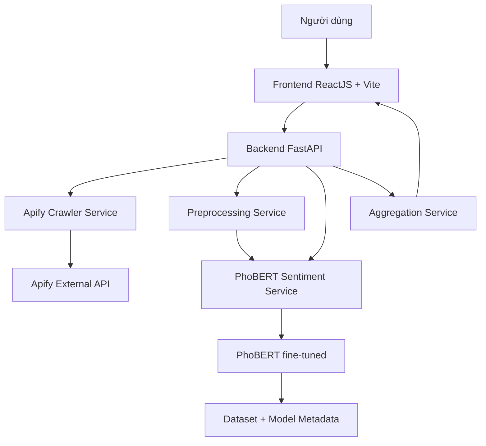

# KhaUniSent

**Hệ thống nhận diện cảm xúc bình luận TikTok tiếng Việt bằng PhoBERT fine-tuning**

- Sinh viên thực hiện: **Lê Tuấn Kha**
- MSSV: **110122086**
- Trường: **Đại học Trà Vinh - Khoa Công nghệ thông tin**
- Năm thực hiện: **2026**
- Tên repository đề xuất: `tn-da22tta-110122086-letuankha-khaunisent`

> Nếu mã lớp chính thức khác `da22tta`, cần đổi phần mã lớp trong tên repository trước khi nộp.

## 1. Giới thiệu

KhaUniSent là hệ thống phân tích cảm xúc bình luận TikTok tiếng Việt phục vụ theo dõi phản hồi trên các kênh truyền thông của trường đại học. Hệ thống thu thập bình luận TikTok bằng Apify API, tiền xử lý văn bản tiếng Việt, suy luận bằng mô hình **PhoBERT fine-tuned**, sau đó trực quan hóa kết quả trên dashboard ReactJS.

Gemini API không phải mô hình chính của hệ thống. Gemini chỉ được dùng ở trang/script riêng để đối chiếu kết quả trong phần đánh giá.

## 2. Chức năng chính

- Phân tích cảm xúc một bình luận tiếng Việt bất kỳ.
- Phân tích bình luận của một video TikTok.
- Phân tích tổng quan một kênh TikTok theo nhiều video.
- Hiển thị KPI, biểu đồ phân bố cảm xúc, bảng bình luận và video rủi ro.
- So sánh kết quả PhoBERT với Gemini trong luồng riêng.
- Lưu lịch sử phân tích trên frontend.
- Cung cấp script benchmark thời gian xử lý và biểu đồ đánh giá hiệu năng.

## 3. Nhãn cảm xúc

| Nhãn | Ý nghĩa | Màu hiển thị |
|---|---|---|
| `positive` | Tích cực | `#22c55e` |
| `negative` | Tiêu cực | `#ef4444` |
| `neutral` | Trung tính | `#94a3b8` |

## 4. Kiến trúc hệ thống



Chi tiết kiến trúc được trình bày trong [`docs/architecture.md`](docs/architecture.md).

## 5. Công nghệ sử dụng

### Backend

- Python 3.10+
- FastAPI + Uvicorn
- PyTorch
- Hugging Face Transformers
- PhoBERT base: `vinai/phobert-base`
- Pandas, NumPy, Scikit-learn
- Apify API
- python-dotenv

### Frontend

- ReactJS 18
- Vite
- TailwindCSS
- React Router
- Axios
- Recharts
- Ant Design

### AI/NLP

- Mô hình chính: PhoBERT fine-tuned
- Kiến trúc: PhoBERT + Linear layer 768 -> 3 nhãn
- Max sequence length: 256
- Gemini API: chỉ dùng để so sánh, không thay thế mô hình chính

## 6. Kết quả mô hình

| Chỉ tiêu | Giá trị |
|---|---:|
| Tổng mẫu fine-tune | 9,976 |
| Train split | 6,983 |
| Validation split | 1,496 |
| Test split | 1,497 |
| Test Accuracy | 89.18% |
| Weighted F1 | 89.19% |
| Macro F1 | 88.72% |
| Best validation Macro F1 | 90.12% |

Phân phối nhãn:

| Nhãn | Số lượng | Tỷ lệ |
|---|---:|---:|
| Positive | 2,494 | 25.0% |
| Neutral | 5,217 | 52.3% |
| Negative | 2,265 | 22.7% |
| Tổng | 9,976 | 100% |

## 7. Cấu trúc repository nộp đồ án

```text
.
├── docs/
│   ├── Bao_cao_do_an_tot_nghiep_Le_Tuan_Kha.docx
│   ├── Bao_cao_do_an_tot_nghiep_Le_Tuan_Kha.pdf
│   ├── Slide_bao_ve_do_an_Le_Tuan_Kha.pptx
│   ├── Poster_KhaUniSent_A1.pdf
│   ├── HUONG_DAN_SU_DUNG_DEMO.md
│   ├── CHECKLIST_NOP_GITHUB.md
│   ├── architecture.md
│   └── figures/
├── src/
│   ├── backend/
│   ├── frontend/
│   ├── scripts/
│   ├── data/
│   ├── notebooks/
│   ├── models/
│   └── demo/
├── README.md
├── .gitignore
└── LICENSE
```

## 8. Cài đặt và chạy demo

Xem hướng dẫn chi tiết tại:

[`docs/HUONG_DAN_SU_DUNG_DEMO.md`](docs/HUONG_DAN_SU_DUNG_DEMO.md)

Tóm tắt nhanh:

### 8.1. Cấu hình môi trường

```powershell
cd src
copy .env.example .env
```

Điền các biến quan trọng trong `.env`:

```env
APIFY_API_TOKEN=apify_api_xxx
GEMINI_API_KEY=
GEMINI_MODEL=gemini-1.5-flash
PHOBERT_MODEL_PATH=./models/phobert-sentiment-continued
API_PORT=8000
CORS_ORIGINS=http://localhost:5173,http://127.0.0.1:5173
VITE_API_URL=http://127.0.0.1:8000
```

### 8.2. Chạy backend

```powershell
cd src
python -m venv .venv
.\.venv\Scripts\activate
pip install -r backend\requirements.txt
python -m uvicorn backend.main:app --reload --host 0.0.0.0 --port 8000
```

Kiểm tra backend:

```text
http://127.0.0.1:8000/health
```

### 8.3. Chạy frontend

```powershell
cd src\frontend
npm install
npm run dev
```

Truy cập giao diện:

```text
http://127.0.0.1:5173
```

## 9. API chính

| Method | Endpoint | Mục đích |
|---|---|---|
| GET | `/health` | Kiểm tra trạng thái backend/model |
| POST | `/analyze/comment` | Phân tích một bình luận |
| POST | `/analyze/video` | Phân tích bình luận của một video TikTok |
| POST | `/analyze/channel` | Phân tích nhiều video của một kênh TikTok |
| POST | `/compare/gemini` | So sánh PhoBERT với Gemini |

Response chuẩn:

```json
{
  "success": true,
  "data": {},
  "error": null
}
```

## 10. Lưu ý về model

File weight PhoBERT fine-tuned có dung lượng lớn nên không commit trực tiếp lên GitHub. Khi chạy demo, đặt model vào:

```text
src/models/phobert-sentiment-continued/
```

Hoặc cập nhật `PHOBERT_MODEL_PATH` trong `.env` trỏ tới vị trí model trên máy.

## 11. Dữ liệu và đánh giá

- Dataset final: `src/data/export/retrain_manual_phobert_9976.json`
- Dữ liệu tổng hợp comment: `src/data/tong_hop_comment.json`
- Tập đánh giá cố định: `src/data/evaluation/`
- Notebook fine-tune: `src/notebooks/phobert_finetune_final.ipynb`
- Biểu đồ hiệu năng: `docs/figures/performance/`
- Confusion matrix: `docs/figures/model/confusion_matrix_phobert.png`

## 12. Tác giả

**Lê Tuấn Kha**  
MSSV: **110122086**  
Đại học Trà Vinh - Khoa Công nghệ thông tin
