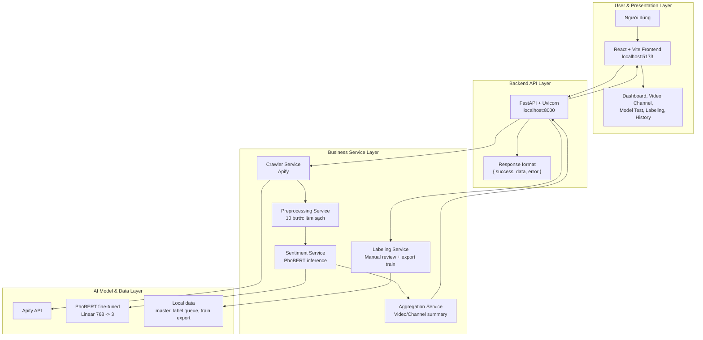

# TikUniSent

> Hệ thống phân tích cảm xúc bình luận TikTok tiếng Việt bằng PhoBERT fine-tuning.


TikUniSent là hệ thống full-stack phục vụ phân tích cảm xúc bình luận TikTok tiếng Việt, tập trung vào các kênh trường đại học. Hệ thống hỗ trợ crawl dữ liệu bằng Apify, tiền xử lý bình luận, phân tích bằng mô hình PhoBERT fine-tuned, trực quan hóa kết quả và hỗ trợ gán nhãn thủ công để tiếp tục cải thiện mô hình.

## Project Info

| Thông tin | Nội dung |
|---|---|
| Tên project | TikUniSent |
| Tác giả | Lê Tuấn Kha |
| MSSV | 110122086 |
| Trường | Đại học Trà Vinh - Khoa CNTT |
| Năm | 2026 |
| Model chính | PhoBERT fine-tuned |
| Bài toán | Phân tích cảm xúc bình luận TikTok tiếng Việt |
| Nhãn cảm xúc | `positive`, `negative`, `neutral` |

## Highlights

- Phân tích cảm xúc bình luận từ một video TikTok.
- Phân tích tổng quan toàn bộ kênh TikTok.
- Test nhanh một comment bất kỳ bằng PhoBERT.
- Dashboard trực quan với KPI, biểu đồ và bảng bình luận.
- Quy trình gán nhãn thủ công có PhoBERT gợi ý.
- Hỗ trợ merge dữ liệu mới và export tập train để fine-tune tiếp.
- Apify token được cấu hình ở backend `.env`, không nhập trực tiếp trên giao diện.
- Model và dữ liệu thật không commit lên GitHub để đảm bảo an toàn.

## Tech Stack

| Layer | Công nghệ |
|---|---|
| Frontend | ReactJS 18, Vite, TailwindCSS, React Router, Axios, Recharts, Ant Design |
| Backend | Python, FastAPI, Uvicorn, Pydantic, python-dotenv |
| NLP | PhoBERT, Hugging Face Transformers, PyTorch |
| Data crawler | Apify API |
| Data processing | Regex preprocessing, JSON dataset, manual labeling queue |
| Visualization | KPI cards, sentiment charts, comment tables |

## Sentiment Labels

| Label | Ý nghĩa | Màu |
|---|---|---|
| `positive` | Tích cực | `#22c55e` |
| `negative` | Tiêu cực | `#ef4444` |
| `neutral` | Trung tính | `#94a3b8` |

## System Architecture



Chi tiết kiến trúc và file draw.io nằm trong:

```text
docs/architecture.md
docs/diagrams/
```

## Main Features

### 1. Model Test

Nhập một comment bất kỳ và nhận kết quả dự đoán:

- nhãn cảm xúc
- confidence
- xác suất của 3 nhãn
- text sau tiền xử lý

### 2. Video Analysis

Luồng xử lý:

```text
TikTok video URL -> Apify crawl comments -> preprocessing -> PhoBERT inference -> charts + comment table
```

### 3. Channel Analysis

Luồng xử lý:

```text
TikTok username -> crawl videos -> crawl comments per video -> sentiment per video -> overall channel summary
```

### 4. Manual Labeling

Quy trình gán nhãn:

```text
Unlabeled comments -> preprocessing -> PhoBERT suggestions -> manual review -> merge master -> export train dataset
```

## Project Structure

```text
TikUniSent/
├── backend/
│   ├── main.py
│   ├── crawler.py
│   ├── sentiment.py
│   ├── preprocessing.py
│   ├── labeling_store.py
│   ├── app/
│   └── requirements.txt
├── frontend/
│   ├── src/
│   ├── package.json
│   ├── vite.config.ts
│   └── tailwind.config.cjs
├── scripts/
│   ├── merge_apify_comments_to_master.py
│   ├── prepare_retrain_datasets.py
│   └── check_train_readiness.py
├── docs/
│   ├── architecture.md
│   └── diagrams/
├── data/
│   └── samples/
├── models/
│   └── README.md
├── .env.example
├── .gitignore
├── LICENSE
└── README.md
```

## Environment Variables

Tạo file `.env` từ `.env.example`:

```env
APIFY_API_TOKEN=
PHOBERT_MODEL_PATH=./models
VNCORENLP_PATH=./models/vncorenlp
API_HOST=0.0.0.0
API_PORT=8000
CORS_ORIGINS=http://localhost:5173,http://127.0.0.1:5173
VITE_API_URL=http://127.0.0.1:8000
```

> Không commit `.env` lên GitHub.

## Model Setup

Model weights không được commit vào repository. Đặt model fine-tuned vào thư mục local:

```text
models/
├── config.json
├── model.safetensors hoặc pytorch_model.bin
├── tokenizer_config.json
├── vocab.txt
├── bpe.codes
└── training_metadata.json
```

Backend sẽ đọc model từ:

```env
PHOBERT_MODEL_PATH=./models
```

## Installation

### Backend

```powershell
cd D:\Do_an_tot_nghiep\TikUniSent
python -m venv .venv
.\.venv\Scripts\activate
python -m pip install --upgrade pip
pip install -r backend\requirements.txt
```

Nếu máy không dùng CUDA, nên cài PyTorch CPU:

```powershell
pip uninstall -y torch torchvision torchaudio
pip install torch --index-url https://download.pytorch.org/whl/cpu
```

### Frontend

```powershell
cd D:\Do_an_tot_nghiep\TikUniSent\frontend
npm install
```

## Run Locally

### Start Backend

```powershell
cd D:\Do_an_tot_nghiep\TikUniSent
.\.venv\Scripts\python.exe -m uvicorn backend.main:app --reload --host 0.0.0.0 --port 8000
```

Health check:

```text
http://127.0.0.1:8000/health
```

### Start Frontend

```powershell
cd D:\Do_an_tot_nghiep\TikUniSent\frontend
npm run dev
```

Open:

```text
http://127.0.0.1:5173
```

## API Overview

| Method | Endpoint | Mô tả |
|---|---|---|
| `GET` | `/health` | Kiểm tra trạng thái backend và model |
| `GET` | `/stats` | Lấy KPI dashboard |
| `POST` | `/analyze/comment` | Test một comment bằng PhoBERT |
| `POST` | `/analyze/video` | Phân tích bình luận của một video TikTok |
| `POST` | `/analyze/channel` | Phân tích nhiều video/comment của một kênh TikTok |
| `GET` | `/labeling/queue` | Lấy hàng đợi comment chưa gán nhãn |
| `POST` | `/labeling/queue/prelabel` | Gợi ý nhãn bằng PhoBERT |
| `POST` | `/labeling/queue/merge-master` | Gộp nhãn thủ công vào master dataset |

Response chuẩn:

```json
{
  "success": true,
  "data": {},
  "error": null
}
```

## Demo Flow

Khi demo/bảo vệ, nên trình bày theo thứ tự:

1. Mở trang tổng quan để kiểm tra backend/model health.
2. Vào **Test model** và nhập một comment bất kỳ.
3. Vào **Phân tích video** và dán URL TikTok.
4. Vào **Phân tích kênh** để xem tổng hợp theo nhiều video.
5. Vào **Gán nhãn** để trình bày quy trình cải thiện dữ liệu train.

## Data & Privacy

Repository này không chứa:

- Apify API token
- model weights
- dataset TikTok thật
- file backup
- file báo cáo cá nhân
- `node_modules`
- virtual environment

Các dữ liệu runtime cần đặt local và đã được `.gitignore` bảo vệ.

## Roadmap

- Chuẩn hóa preprocessing cho cả training và inference.
- Tích hợp VnCoreNLP vào pipeline chính.
- Thêm API history backend thay vì chỉ lưu local frontend.
- Tối ưu tốc độ phân tích kênh bằng background jobs.
- Thêm Docker Compose cho backend + frontend.
- Xuất báo cáo PDF/Excel từ kết quả phân tích.

## Author

**Lê Tuấn Kha**  
MSSV: `110122086`  
Đại học Trà Vinh - Khoa CNTT  
Năm: 2026

## License

This project is distributed under the license included in the `LICENSE` file.

