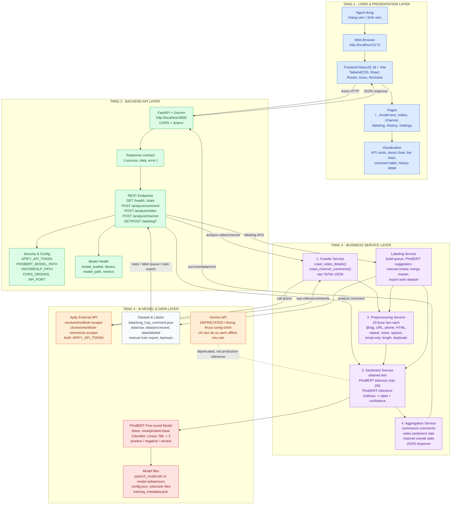

# TikUniSent System Architecture

## Mermaid Diagram

## Component Description

| Layer | Component | Current Implementation | Responsibility |
|---|---|---|---|
| User & Presentation | Browser | `http://localhost:5173` | Người dùng truy cập hệ thống qua trình duyệt. |
| User & Presentation | Frontend | React 18, Vite, TailwindCSS, React Router, Axios, Recharts | Gửi request, nhận response, hiển thị KPI, biểu đồ, bảng comment và lịch sử. |
| User & Presentation | Pages | `/`, `/model-test`, `/video`, `/channel`, `/labeling`, `/history`, `/settings` | Các màn hình nghiệp vụ hiện có trong frontend. |
| Backend API | FastAPI app | `backend/main.py` | Định nghĩa API, CORS, error handler, startup load model. |
| Backend API | Response contract | `backend/app/utils/response.py` | Chuẩn hóa response `{ success, data, error }`. |
| Backend API | Health check | `GET /health` | Trả trạng thái model, device, model path, metric metadata và trạng thái Apify. |
| Business Service | Crawler Service | `backend/crawler.py` | Gọi Apify để crawl video, channel và comment TikTok. |
| Business Service | Preprocessing Service | `backend/preprocessing.py`, `modules/text_preprocessor.py` | Làm sạch text, loại comment không phù hợp cho gán nhãn hoặc inference. |
| Business Service | Sentiment Service | `backend/sentiment.py` | Load PhoBERT fine-tuned, tokenize, inference, softmax, trả label/confidence. |
| Business Service | Aggregation Service | `summarize()` trong `backend/sentiment.py`, logic trong `backend/main.py` | Tổng hợp sentiment theo video và theo kênh. |
| Business Service | Labeling Service | `backend/labeling_store.py` | Tạo queue, gợi ý bằng PhoBERT, lưu nhãn thủ công, merge master, export train. |
| AI & Data | PhoBERT fine-tuned | `PHOBERT_MODEL_PATH`, fallback `models/` | Model chính duy nhất cho luồng phân tích production. |
| AI & Data | Apify API | `clockworks/tiktok-scraper`, `clockworks/tiktok-comments-scraper` | Nguồn crawl dữ liệu TikTok. |
| AI & Data | Dataset | `data/tong_hop_comment.json`, `data/labeled/*`, `data/backup/*` | Lưu dữ liệu master, queue gán nhãn, train export và backup. |
| AI & Data | Gemini | Còn code import/init nhưng bị chặn trong API phân tích | Nên đánh dấu deprecated hoặc xóa khỏi runtime chính. |

## Main Data Flows

| Flow | Steps | Output |
|---|---|---|
| Analyze one comment | Frontend `/model-test` -> `POST /analyze/comment` -> PhoBERT tokenize/inference -> softmax | `{ sentiment, confidence, scores, text_clean }` |
| Analyze video | Frontend `/video` -> `POST /analyze/video` -> Apify comments scraper -> preprocess/inference -> summarize | Video title, sentiment summary, details per comment |
| Analyze channel | Frontend `/channel` -> `POST /analyze/channel` -> Apify video scraper -> comments per video -> per-video inference -> channel aggregation | Channel info, overall summary, video list, per-video details |
| Label new comments | Frontend `/labeling` -> `GET /labeling/queue` -> preprocess unlabeled comments -> PhoBERT prelabel -> manual review | Label queue with suggested labels |
| Merge labels to train | Frontend `/labeling` -> `POST /labeling/queue/merge-master` -> update `tong_hop_comment.json` -> export manual train file | Updated master dataset and `phobert_retrain_manual_master.json` |
| Dashboard stats | Frontend overview -> `GET /stats` -> read `data/tong_hop_comment.json` | KPI totals and positive percentage |

## Architecture Audit Against Current Code

### ✅ Đúng với kiến trúc

| Item | Evidence |
|---|---|
| Backend dùng FastAPI + CORS + dotenv | `backend/main.py` |
| Response chuẩn `{ success, data, error }` | `success_response`, `error_response` trong `backend/app/utils/response.py` |
| Có `/health`, `/stats`, `/analyze/video`, `/analyze/channel`, `/analyze/comment`, `/labeling/*` | `backend/main.py` |
| Frontend dùng React 18 + Vite + Axios + Router + Recharts | `frontend/package.json`, `frontend/src/App.jsx`, `frontend/src/services/api.js` |
| Apify token được resolve ở backend | `resolve_apify_token()` trong `backend/main.py` |
| PhoBERT là luồng inference chính | `backend/sentiment.py`, `analyze_batch()` luôn gọi `_predict_phobert()` |
| API phân tích chặn `model='gemini'` | `/analyze/video`, `/analyze/channel`, `/analyze/comment` trong `backend/main.py` |
| Có labeling queue, prelabel, merge master, export train | `backend/labeling_store.py` |
| Constants 3 nhãn và màu sắc thống nhất | `backend/app/core/constants.py`, `frontend/src/utils/constants.js` |

### ⚠️ Cần điều chỉnh

| Item | Lý do | Cách chỉnh |
|---|---|---|
| Frontend route tổng quan là `/`, không phải `/overview` | Yêu cầu kiến trúc ghi `/overview`; code hiện dùng `/` | Thêm route alias `/overview` trỏ về `OverviewPage`, hoặc sửa tài liệu thành `/`. |
| Frontend có thêm `/model-test` và `/labeling` | Không nằm trong danh sách 5 trang ban đầu, nhưng đang là chức năng thực tế | Giữ trong kiến trúc vì phục vụ bảo vệ và gán nhãn/fine-tune. |
| Frontend gọi `GET /history` nhưng backend chưa có endpoint tương ứng | `api.js` có `HISTORY`, `App.jsx` có HistoryPage; `backend/main.py` chưa định nghĩa `/history` | Thêm backend history endpoint hoặc bỏ/ẩn chức năng history nếu không dùng. |
| `.env.example` đang là template cũ YouTube/Gemini/Supabase | Không khớp biến môi trường TikUniSent | Viết lại `.env.example` gồm `APIFY_API_TOKEN`, `PHOBERT_MODEL_PATH`, `VNCORENLP_PATH`, `API_PORT`, `CORS_ORIGINS`, `VITE_API_URL`. |
| Preprocessing inference và labeling đang dùng hai module khác nhau | `backend/preprocessing.py` cho labeling; `backend/sentiment.py` thử import `modules.text_preprocessor.preprocess` | Nên gom về một module preprocessing chuẩn để train/inference/labeling cùng logic. |
| VnCoreNLP chưa được dùng trong sentiment code hiện tại | Kiến trúc yêu cầu VnCoreNLP tách từ trước PhoBERT, nhưng `backend/sentiment.py` chưa gọi VnCoreNLP | Tích hợp VnCoreNLP hoặc cập nhật kiến trúc nói rõ hiện tại dùng tokenizer của Hugging Face trực tiếp. |
| CORS đang `allow_origins=['*']` | Yêu cầu có `CORS_ORIGINS`, nhưng code chưa đọc env này | Đọc `CORS_ORIGINS` từ `.env` và cấu hình allowlist. |

### ❌ Sai hoàn toàn

| Item | Lý do | Cách sửa |
|---|---|---|
| Gemini vẫn còn trong runtime health/model init | Yêu cầu mới nói Gemini không còn được dùng nữa; code vẫn import `google.genai`, `_init_gemini()`, `gemini_enabled` | Gỡ import/init Gemini khỏi `backend/sentiment.py`, bỏ `gemini_enabled` khỏi health hoặc đổi thành `deprecated=false`. |
| `backend/requirements.txt` vẫn có `google-genai` | Không còn cần nếu Gemini bị loại khỏi kiến trúc | Xóa `google-genai>=1.0.0` sau khi gỡ code Gemini. |
| `backend/services/gemini_api.py` còn tồn tại | Dễ gây hiểu nhầm Gemini là một service đang dùng | Xóa file hoặc đổi tên sang `deprecated_gemini_api.py` và không import ở runtime. |
| `.env.example` còn `GEMINI_API_KEY`, YouTube, Supabase | Sai domain của TikUniSent hiện tại | Viết lại hoàn toàn `.env.example` theo backend/frontend hiện tại. |

### 🗑️ Cần xóa

| File/Item | Lý do |
|---|---|
| `backend/services/gemini_api.py` | Gemini không còn là thành phần production theo yêu cầu mới. |
| `google-genai` trong `backend/requirements.txt` | Dependency không cần thiết nếu bỏ Gemini. |
| `GEMINI_API_KEY` trong `.env.example` | Không nên hướng dẫn cấu hình dịch vụ đã deprecated. |
| Các biến YouTube/Supabase cũ trong `.env.example` | Không thuộc kiến trúc TikUniSent FastAPI + React + PhoBERT hiện tại. |

